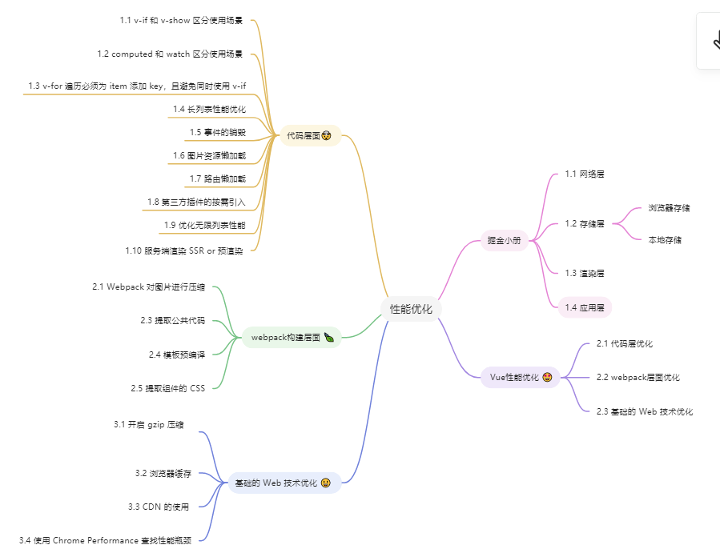

> 为什么要做性能优化 四字总结：“降本提效”-----降低成本，提高效率

> 修言老师掘金小册性能优化  
--- 网络层      
--- 存储层 
    -- 浏览器存储
    -- 本地存储 [Local Storage 与 Session Storage 、cookie、session 的区别]
--- 渲染层 
--- 应用层

如何做性能优化？
总体分为两部分：
代码层面和构建层面

CDN
懒加载和 预加载 及其区别
减少回流重绘
节流防抖
对图片进行优化
webpack 优化
代码压缩
按需加载
tree shaking

vue 性能优化：
一、代码层面的优化

1.1 v-if 和 v-show 区分使用场景
1.2 computed 和 watch 区分使用场景
1.3 v-for 遍历必须为 item 添加 key，且避免同时使用 v-if
1.4 长列表性能优化
1.5 事件的销毁
1.6 图片资源懒加载
1.7 路由懒加载
1.8 第三方插件的按需引入
1.9 优化无限列表性能
1.10 服务端渲染 SSR or 预渲染

二、Webpack 层面的优化

2.1 Webpack 对图片进行压缩
2.3 提取公共代码
2.4 模板预编译
2.5 提取组件的 CSS

三、基础的 Web 技术优化

3.1 开启 gzip 压缩
3.2 浏览器缓存
3.3 CDN 的使用
3.4 使用 Chrome Performance 查找性能瓶颈

