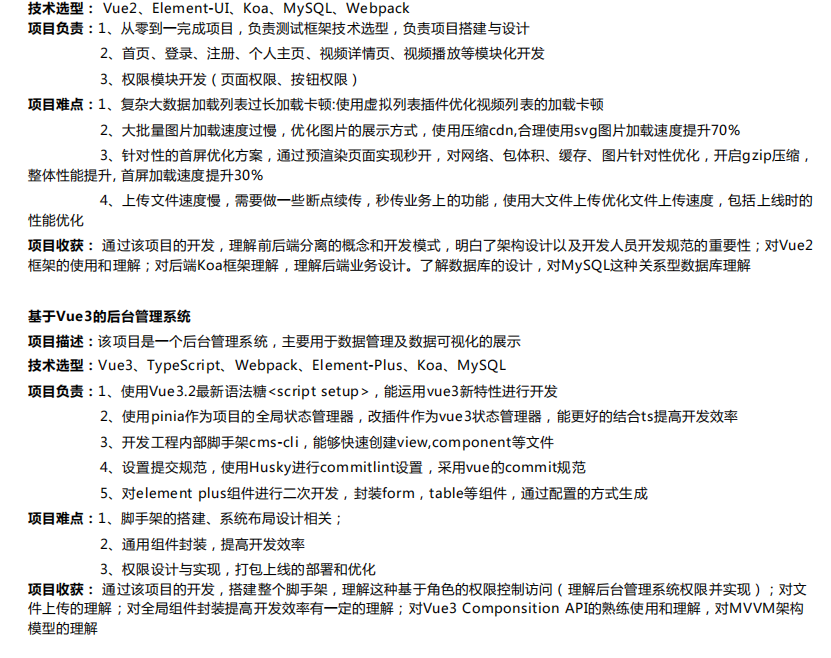

目标：秋招结束之前投递米哈游并面试
>JD:    1.计算机或相关专业；
>
>2.深刻理解计算机原理、数据结构、常用算法和常见设计模式；
>
>3.熟悉ES6/CSS3/HTML5 等基础语法和开发调试技术，熟悉React或者Vue框架（React加分）；
>
>4.对创建前端UI有强烈的兴趣和成就感；
>
>5.有WEB类实战开发经验加分。

任务点：
一、重算法

二、手写题

三、项目【最重要的部分】        沉淀和思考         成果收益及数据体现

        ----性能优化！          与 设计模式
    
        ----虚拟列表！！
    
        ----大文件上传-切片！！！
    
        ----CDN压缩，svg图片加载，GZIP压缩原理，首屏加速
    
        ---后台管理系统最重要的权限相关的设计与实现

四、八股一定要熟悉

        ---计算机原理
    
        ---数据结构
    
        ---设计模式
    
        ---ES6/CSS3/HTML5

添加 项目成果：大文件上传速度是多少？打包上线时的性能优化优化了包体积，首页首屏速度还是网络速度还是缓存速度【数据支撑】主观能动性和积极性

